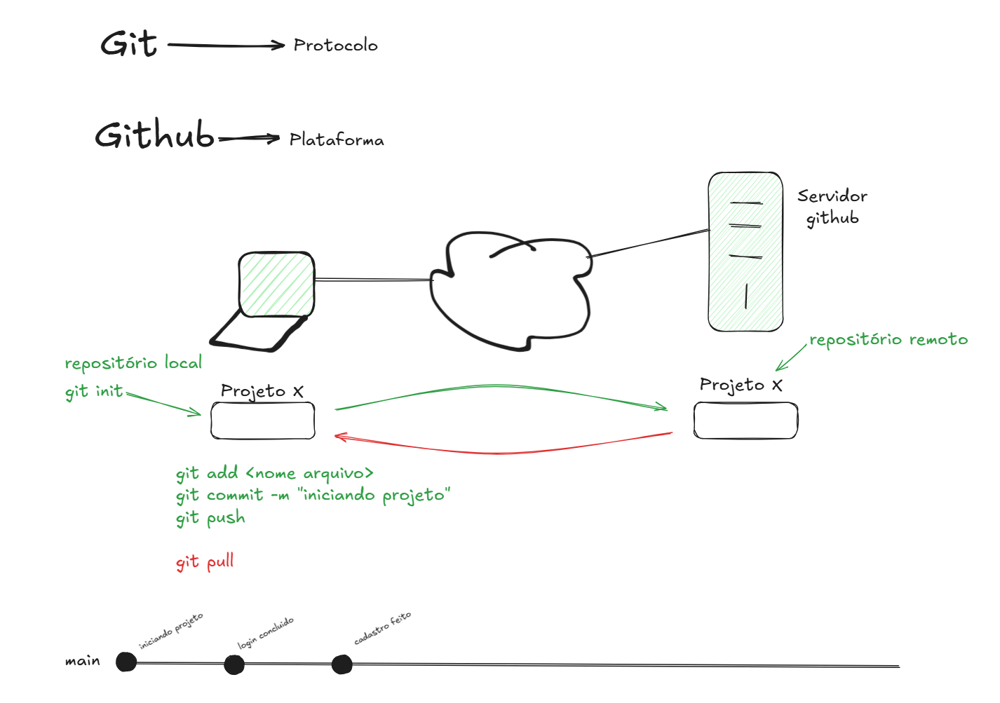

# Aula 3 — 10/03/2026 (Terça-feira)

Terceira aula do curso de **Algoritmo e Lógica de Programação**.

## 📂 Conteúdo

| Arquivo | Descrição |
|---------|-----------|
| `anotacoes-prof.png` | Anotações do professor sobre Git e GitHub feitas durante a aula |

## 📝 Temas abordados

- Introdução ao controle de versão
- O que é Git e o que é GitHub
- Diferença entre Git e GitHub
- Criação e gerenciamento de repositórios
- Comandos básicos do Git (`git init`, `git add`, `git commit`, `git push`, `git clone`)
- Fluxo de trabalho com Git e GitHub

## 🖼️ Anotações do Professor

## 🛠️ Tecnologias

- **Git**
- **GitHub**
